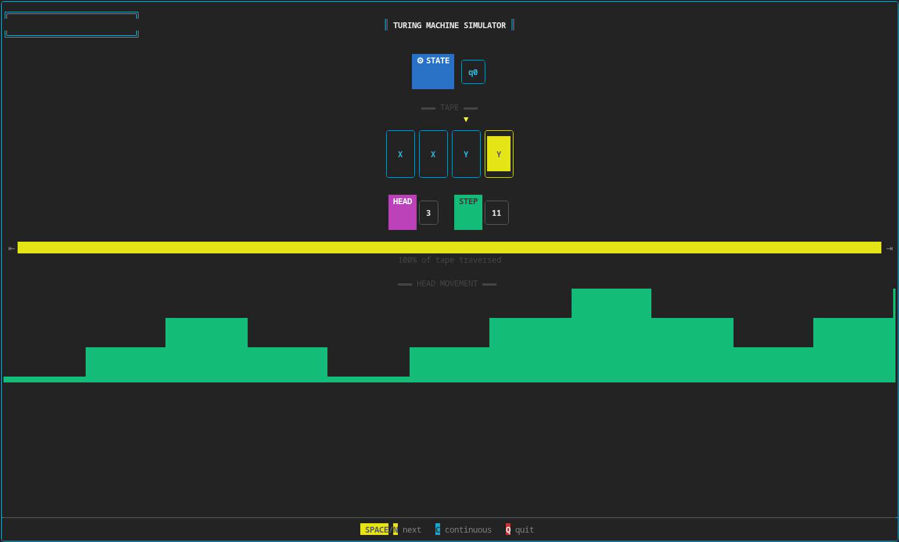

# 🧠 Automata — Universal Turing Machine Simulator

<p align="center">
  
  
</p>

<p align="center">
  <b>A general-purpose Universal Turing Machine simulator with an interactive terminal interface powered by FTXUI 🚀</b>
</p>

<p align="center">
  
  
  
  
  
</p>

---

# 📖 About The Project

**Automata** is a **general-purpose Universal Turing Machine Simulator** written in **C++17**.

Instead of implementing a single Turing machine in code, the simulator loads the complete machine description—including its states, alphabets, transition function (δ), start state, accepting states, and rejecting states—from a **JSON** file and executes it dynamically.

The simulator is completely machine-independent: any valid Turing machine can be executed simply by changing the input JSON file, without recompiling or modifying the source code.

The demonstration scenario models a robot passing through a security checkpoint by processing a binary access code and moving heavy blocks—all performed exclusively through Turing machine state transitions.

---

# ✨ Features

* 🧠 Universal Turing Machine simulator
* 📄 Loads machine definitions from JSON
* ♾️ Infinite dynamically expanding tape
* ⚡ Efficient transition lookup
* 🎨 Beautiful interactive terminal UI using **FTXUI**
* ▶️ Step-by-step execution
* ⏯️ Continuous execution with pause support
* 📊 Live tape visualization
* 🎯 Live state and head tracking
* 🚀 Batch mode (`--batch`)
* 🧵 Multithreaded execution
* 🏗️ Clean modular architecture following SOLID principles

---

# 🖥️ Interactive Terminal UI

Instead of printing plain text to the terminal, the simulator provides a rich visual interface using **FTXUI**.

The interface displays:

* 📼 Animated tape updates
* 🎯 Current machine state
* 📍 Current tape head position
* 🎨 Colored tape cells
* ⏯️ Step / Run / Pause controls
* 📊 Live execution statistics
* ✅ ACCEPTED
* ❌ REJECTED
* ⏱️ TIMEOUT

The UI transforms a traditional console application into an interactive visualization of computation theory.

---

# 🚀 Execution Modes

The simulator supports two different execution modes.

## Interactive Mode

```bash
./automata examples/machine.json
```

Launches the full FTXUI interface where users can:

* Execute one transition at a time
* Run continuously
* Pause execution
* Watch the tape evolve in real time

---

## Batch Mode

```bash
./automata examples/machine.json --batch
```

Batch mode executes the machine **without opening the UI**.

Only the final result is printed:

```
ACCEPTED
```

or

```
REJECTED
```

or

```
TIMEOUT
```

This mode is especially useful for:

* automated testing
* benchmarking
* scripting
* comparing different machines

---


# 📦 Dependencies

| Library              | Purpose                             |
| -------------------- | ----------------------------------- |
| 💜 **FTXUI**         | Interactive terminal interface      |
| 📄 **nlohmann/json** | Parsing Turing machine descriptions |

Both libraries are automatically downloaded through **CMake FetchContent**.

No manual installation is required.

---

# 🏗️ Architecture & Design

The project intentionally applies software engineering principles only where they improve the design.

| Component            | Design Decision                    | Reason                            |
| -------------------- | ---------------------------------- | --------------------------------- |
| **TuringMachine**    | Handles execution only             | Separation of concerns            |
| **DynamicTape**      | Infinite expandable tape           | Simulates a real Turing machine   |
| **TransitionTable**  | Efficient `(state,symbol)` lookup  | Fast execution                    |
| **MachineLoader**    | Loads directly from JSON           | Simple architecture               |
| **StepInfo**         | DTO between core and UI            | Decouples renderer from simulator |
| **Renderer (FTXUI)** | Responsible only for visualization | Easy UI replacement               |
| **Result enum**      | ACCEPTED / REJECTED / TIMEOUT      | Explicit execution outcomes       |

---

# 📐 UML Diagram

<p align="center">

</p>

---

# 📂 Project Structure

```text
automata_project/
├── include/
│   ├── DynamicTape.hpp
│   ├── MachineLoader.hpp
│   ├── Renderer.hpp
│   ├── StepInfo.hpp
│   ├── Transition.hpp
│   ├── TransitionTable.hpp
│   └── TuringMachine.hpp
│
├── src/
│   ├── DynamicTape.cpp
│   ├── MachineLoader.cpp
│   ├── Renderer.cpp
│   ├── TransitionTable.cpp
│   ├── TuringMachine.cpp
│   └── main.cpp
│
├── examples/
│   └── machine.json
│
├── pics/
│   ├── images.png
│   ├── tui.png
│   └── uml.jpeg
│
├── CMakeLists.txt
└── README.md
```

---

# ⚙️ Build

```bash
git clone https://github.com/aminrm4/automata_project.git

cd automata_project

mkdir build

cd build

cmake ..

make
```

---

# ▶️ Usage

Interactive mode

```bash
./automata ../examples/machine.json
```

Batch mode

```bash
./automata ../examples/machine.json --batch
```

---

# 👥 Contributors

<div align="center">

|                                                            GitHub                                                            |      Name      |  Student ID |
| :--------------------------------------------------------------------------------------------------------------------------: | :------------: | :---------: |
|          <a href="https://github.com/aminrm4"><br>@aminrm4</a>          |      Amin      | 40312358013 |
| <a href="https://github.com/AbolfazlAsali"><br>@AbolfazlAsali</a> | Abolfazl Asali | 40312358030 |

</div>

---

# 📜 License

This project was developed as a **Theory of Languages and Automata** course assignment at **Bu-Ali Sina University** and is shared for educational and academic purposes.

---

<p align="center">

Built with ❤️, ☕, C++17, FTXUI, and many late-night debugging sessions.

</p>
