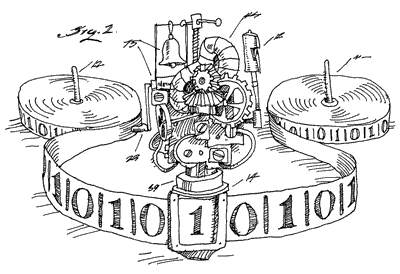
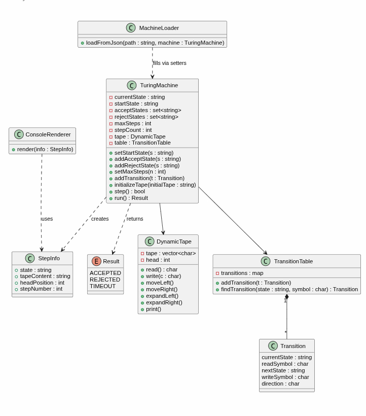

<p align="center">
  
</p>

<h1 align="center">🧠 Automata — Universal Turing Machine Simulator 🧠</h1>

<p align="center">
  <b>A general-purpose Turing Machine simulator with a gorgeous terminal UI 🚀</b>
</p>

<p align="center">
  
  
  
  
</p>

---

## 📖 About The Project

This project is a **general-purpose Universal Turing Machine Simulator** implemented in **C++** 🎯. The program reads the description of *any* Turing machine (states, alphabets, transition function δ) from a **JSON** file and executes it on a dynamic tape — without a single line of code ever being written for a specific machine ✨.

The core scenario 🤖: a robot passes through a security gate by processing an access code (0s and 1s) and shifting heavy blocks out of the way — all done **purely through Turing machine states**, with no helper program variables involved.

---

## 🖥️ Terminal UI Powered by FTXUI

Instead of dumping plain text to the console, the step-by-step execution of the machine (state transitions, tape contents, head position) is rendered with 💜 **[FTXUI](https://github.com/ArthurSonzogni/FTXUI)**, turning a dry simulation into a live, interactive, visual experience:

- 📼 **Live, animated** visualization of the head moving across the tape
- 🎨 Distinct coloring for the current state, the symbol under the head, and blank cells
- ⌨️ Interactive execution control (step-by-step / continuous run / pause) directly from the terminal
- 📊 Live step counter and status display (running / Accept ✅ / Reject ❌ / Timeout ⏱️)

> Without FTXUI, this project would just be a dry text-based simulator; with FTXUI, it becomes a real visual experience of computation theory 🔥

---

## 📦 Dependencies

| Library | Purpose |
|---|---|
| 💜 [**FTXUI**](https://github.com/ArthurSonzogni/FTXUI) | Terminal UI — renders the live, interactive view of states, tape, and head movement |
| 📄 [**nlohmann/json**](https://github.com/nlohmann/json) | Parses the machine description (states, alphabets, transitions) from the input `.json` file |

Both are fetched automatically via CMake's `FetchContent` — no manual installation required, just build 🛠️

---

## 🏗️ Architecture & Design Patterns

The design deliberately uses design patterns **only where they earn their keep** — not more, not less:

| Area | Design Decision | Why? 🤔 |
|---|---|---|
| **Single Responsibility Principle** | `TuringMachine` only handles execution logic; `ConsoleRenderer`/FTXUI view only handles display | High testability, UI can change without touching core logic |
| **Dynamic tape (`DynamicTape`)** | Auto-expanding buffer in both directions | A real Turing machine has no bounded tape length |
| **Independent transition table (`TransitionTable`)** | Fast `(state, symbol) → Transition` lookup via a `map` | Keeps δ's data separate from the execution engine |
| **Setter-based loading (no extra Builder)** | `MachineLoader` fills the machine directly through public setters | With a fixed JSON format, an extra intermediary layer was unnecessary |
| **Simple DTO for step data (`StepInfo`)** | Each step is packaged into an independent data bundle passed to the renderer | The renderer has zero dependency on `TuringMachine` or `DynamicTape` |
| **Enum return type for outcomes (`Result`)** | `run()` explicitly distinguishes `ACCEPTED` / `REJECTED` / `TIMEOUT` | A Turing machine rejection is a normal outcome, not an exception |

---

## 📐 UML Diagram

<p align="center">
  
</p>

---

## 📂 Project Structure

```
automata_project/
├── include/          # 📌 Class headers (Tape, TransitionTable, TuringMachine, ...)
├── src/               # ⚙️ Class implementations + main.cpp
├── pics/              # 🖼️ Documentation images
│   ├── images.png     #    Project banner
│   └── uml.jpeg        #    UML diagram
└── CMakeLists.txt     # 🛠️ CMake build configuration
```

---

## ⚙️ Building the Project (CMake)

```bash
git clone https://github.com/aminrm4/automata_project.git
cd automata_project
mkdir build && cd build
cmake ..
make
./automata ../examples/machine.json
```

---

## 👥 Contributors

<div align="center">

| GitHub | Name | Student ID |
|:---:|:---:|:---:|
| <a href="https://github.com/aminrm4"><br/>@aminrm4</a> | Amin 💻 | ۴۰۳۱۲۳۵۸۰۱۳ |
| <a href="https://github.com/AbolfazlAsali"><br/>@AbolfazlAsali</a> | Abolfazl Asali 🧩 | ۴۰۳۱۲۳۵۸۰۳۰ |

</div>

---

## 📜 License

This project was developed as a **student assignment** for the **Theory of Languages and Automata** course at **Bu-Ali Sina University** 🎓📚. It is shared for academic and educational purposes.

---

<p align="center">
  Built with ❤️, ☕️ and a lot of late-night debugging for our Theory of Computation course 🎓
</p>
